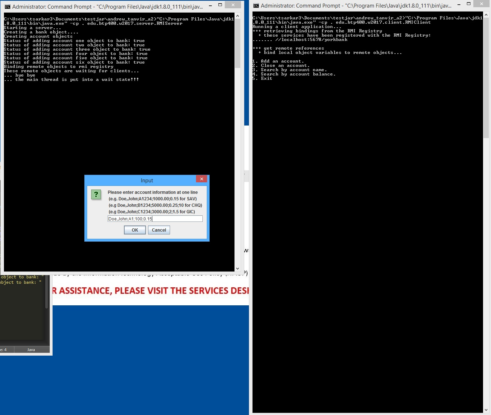
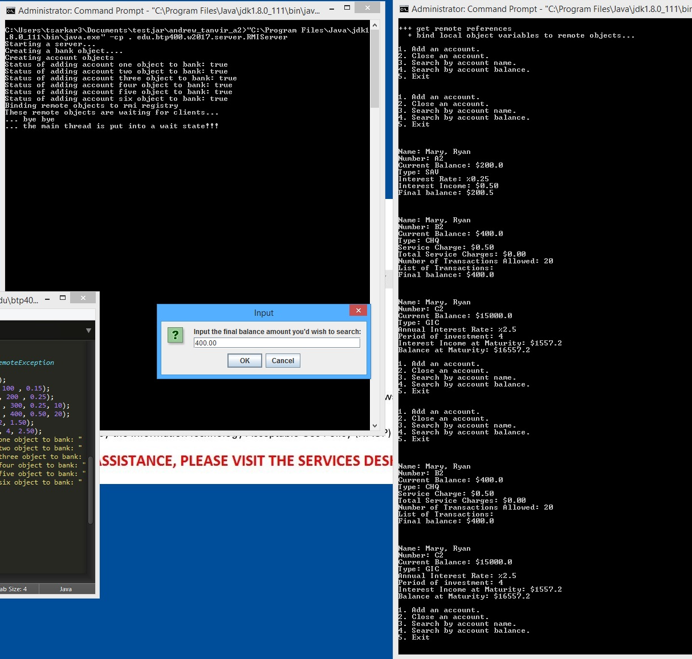

# java-rmi-bank-app

This is a console based client-server app (with Swing UI components) for managing various types of bank accounts. Different types of accounts can be created (such as savings, chequing, GIC) and various actions can be performed at each user input prompt (such as deposit/withdrawl, account search, account creation, etc.). This was an assignment as part of an OOP in Java course at Seneca, focusing on RMI. 

Developers: Tanvir Sarkar, Andrew Koung

## Instructions

1. Navigate to the repo after cloning or downloading
2. Compile
	- server: `javac -cp . edu\btp400\w2017\server\RMIServer.java`
	- client: `javac -cp . edu\btp400\w2017\client\RMIClient.java`
3. Run
	- server: `java -cp . edu.btp400.w2017.server.RMIServer`
	- client: `java -cp . edu.btp400.w2017.client.RMIClient`

Note: Substitute `\ for /` on Linux systems.

## Screenshots

